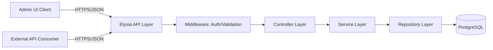
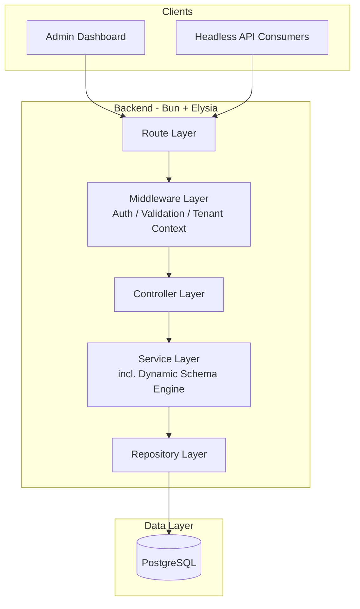
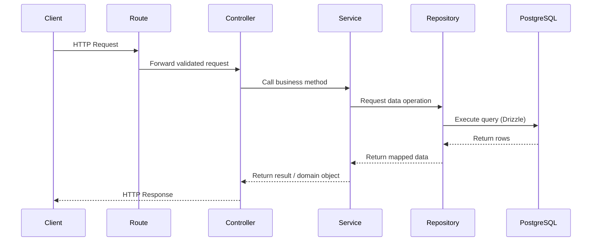
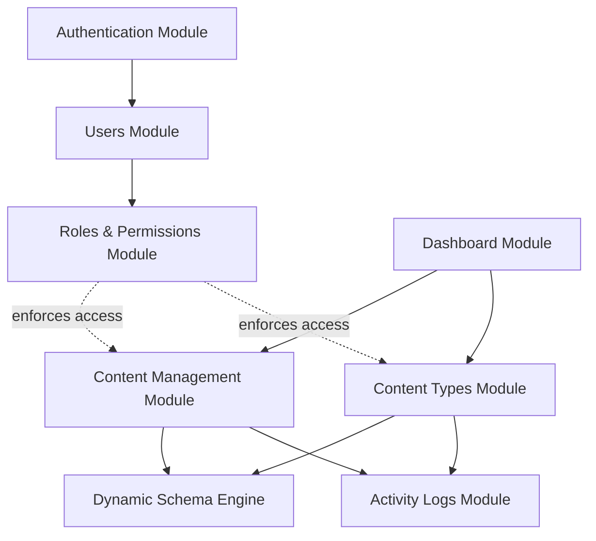
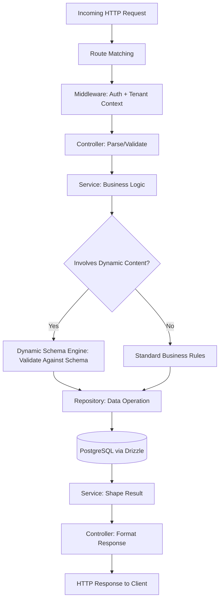

# System Architecture Document: Generic Dynamic CMS

**Version:** 1.0
**Status:** Draft
**Last Updated:** July 10, 2026

---

## 1. Introduction

### 1.1 Purpose
This document describes the system architecture of the Generic Dynamic CMS backend — how the system is structured, how components interact, and the principles guiding those decisions. It is intended for engineers, architects, and technical reviewers who need to understand the internal organization of the system independent of specific feature or API details.

### 1.2 Architectural Goals
- **Genericity:** Support arbitrary, admin-defined content types without new backend code per type.
- **Separation of Concerns:** Each layer has one clear responsibility.
- **Predictable Request Flow:** Every request follows the same path through the system, making behavior easy to trace and debug.
- **Extensibility:** New modules (features) can be added without disrupting existing ones.
- **Testability:** Business logic is isolated from framework and database concerns so it can be tested independently.
- **Scalability:** The architecture should accommodate growth in tenants, content volume, and traffic without structural rewrites.

---

## 2. High-Level Architecture

### 2.1 System Overview
The system is a backend service exposing HTTP APIs consumed by an admin UI (content management) and external clients (content delivery). At its core is a **Dynamic Schema Engine**: instead of generating new tables/models/controllers for each content type, the system stores content type definitions as schema metadata and uses a generic content engine to validate, store, and retrieve data according to that metadata.

### 2.2 Major System Components
- **API Layer (Elysia on Bun):** Handles HTTP routing, request validation, and response formatting.
- **Authentication Layer:** JWT-based identity and session verification.
- **Business Logic Layer (Services):** Encapsulates application rules, including the dynamic schema engine logic.
- **Data Access Layer (Repositories):** Encapsulates all Drizzle ORM/PostgreSQL interaction.
- **Database (PostgreSQL):** Stores relational metadata (content type definitions, users, roles) and dynamic content data.

### 2.3 Client → Backend → Database Interaction



### 2.4 High-Level Architecture Diagram



---

## 3. Backend Layered Architecture

The backend follows a strict top-down layered architecture: **Route → Controller → Service → Repository → Database**. Each layer only communicates with the layer directly below it.

### 3.1 Layer Responsibilities

| Layer | Responsibility |
|---|---|
| **Route** | Declares HTTP endpoints, binds them to controller functions, applies route-level middleware (auth guards, schema validation hooks). No business logic. |
| **Controller** | Parses and validates the incoming request, invokes the appropriate service method, and shapes the HTTP response (status codes, payload structure). Contains no business logic or DB access. |
| **Service** | Contains all business logic — including the dynamic schema engine's validation and orchestration logic. Coordinates one or more repositories. Framework-agnostic. |
| **Repository** | Encapsulates all database queries via Drizzle ORM. No business logic — only data access and query construction. |
| **Database** | PostgreSQL persistence layer storing both relational metadata and dynamic content data. |

### 3.2 Request Flow Diagram



---

## 4. Module Architecture

The application is organized into self-contained **feature modules**, each owning its own route, controller, service, repository, and schema files. Modules communicate with each other only through their service layers — never directly through repositories — to preserve encapsulation.

### 4.1 Core Modules

- **Authentication** — login, token issuance/refresh, session handling
- **Users** — user accounts, tenant membership
- **Roles & Permissions** — role definitions and access control checks
- **Content Types** — CRUD for schema definitions (the metadata describing dynamic content)
- **Dynamic Schema Engine** — validates and interprets content type definitions; the generic engine that other modules rely on to process arbitrary content
- **Content Management** — CRUD for entries (actual content instances) using the Dynamic Schema Engine for validation
- **Dashboard** — aggregated read-only views/statistics for the admin UI
- **Activity Logs** — records significant actions across modules

### 4.2 Module Interaction



Each arrow represents a service-to-service call. Modules do not reach into another module's repository layer directly.

---

## 5. Component Responsibilities

| Component | Responsibility | Communicates With |
|---|---|---|
| **Route Layer** | Endpoint declaration, middleware binding | Controller |
| **Middleware** | Cross-cutting concerns: JWT verification, tenant context resolution, request validation | Route, Controller |
| **Controller** | Request/response translation | Service |
| **Service** | Business rules, orchestration, dynamic schema interpretation | Repository, other module Services |
| **Repository** | Query construction and execution via Drizzle ORM | PostgreSQL |
| **Dynamic Schema Engine** | Interprets stored content type metadata to validate and structure entry data at runtime | Content Management Service, Content Types Service |
| **Database** | Persistent storage of metadata and dynamic content | Repository layer only |

Components communicate exclusively through well-defined function calls at the service level; there is no direct cross-layer or cross-module access to repositories or the database.

---

## 6. Data Flow

A typical request (e.g., creating a content entry) flows as follows:

1. **Client** sends an HTTP request with a JWT and JSON payload.
2. **Route** matches the endpoint and passes the request to middleware.
3. **Middleware** verifies the JWT, resolves tenant/user context, and attaches it to the request.
4. **Controller** parses and validates the request shape, then calls the corresponding **Service** method.
5. **Service** applies business logic — for content entries, this includes invoking the **Dynamic Schema Engine** to validate the payload against the relevant content type's field definitions.
6. **Service** calls one or more **Repository** methods to persist or retrieve data.
7. **Repository** executes the query against **PostgreSQL** via Drizzle ORM and returns mapped results.
8. **Service** applies any final business transformations and returns a domain result to the **Controller**.
9. **Controller** formats the HTTP response (status code, JSON body).
10. **Route** returns the response to the **Client**.



---

## 7. Architectural Principles

- **Separation of Concerns:** Each layer addresses exactly one aspect of request handling — routing, transport, business logic, or persistence.
- **Single Responsibility Principle:** Every file/class (route, controller, service, repository) has one reason to change.
- **Layered Architecture:** Strict downward dependency flow — Route depends on Controller, Controller on Service, Service on Repository. No layer calls upward.
- **Dependency Direction:** Lower layers (Repository, Database) have no knowledge of upper layers (Controller, Route). This keeps persistence logic reusable and independent of transport concerns.
- **Reusability:** Services can be reused across multiple controllers or invoked by background jobs without change, since they contain no HTTP-specific logic.
- **Scalability:** Stateless service design allows horizontal scaling of the API layer behind a load balancer.
- **Maintainability:** Modules are self-contained, minimizing the blast radius of changes to any one feature.
- **Testability:** Services and repositories can be unit-tested in isolation via dependency injection/mocking, without spinning up the HTTP layer.

---

## 8. Project Structure

```
src/
 ├── modules/
 │    ├── auth/
 │    │     ├── auth.route.ts
 │    │     ├── auth.controller.ts
 │    │     ├── auth.service.ts
 │    │     ├── auth.repository.ts
 │    │     └── auth.schema.ts
 │    ├── users/
 │    │     ├── users.route.ts
 │    │     ├── users.controller.ts
 │    │     ├── users.service.ts
 │    │     ├── users.repository.ts
 │    │     └── users.schema.ts
 │    ├── roles/
 │    │     ├── roles.route.ts
 │    │     ├── roles.controller.ts
 │    │     ├── roles.service.ts
 │    │     ├── roles.repository.ts
 │    │     └── roles.schema.ts
 │    ├── content-types/
 │    │     ├── content-types.route.ts
 │    │     ├── content-types.controller.ts
 │    │     ├── content-types.service.ts
 │    │     ├── content-types.repository.ts
 │    │     └── content-types.schema.ts
 │    ├── dynamic-schema-engine/
 │    │     ├── schema-engine.service.ts
 │    │     ├── schema-validator.ts
 │    │     └── field-type-registry.ts
 │    ├── content/
 │    │     ├── content.route.ts
 │    │     ├── content.controller.ts
 │    │     ├── content.service.ts
 │    │     ├── content.repository.ts
 │    │     └── content.schema.ts
 │    ├── dashboard/
 │    │     ├── dashboard.route.ts
 │    │     ├── dashboard.controller.ts
 │    │     └── dashboard.service.ts
 │    └── activity-logs/
 │          ├── activity-logs.route.ts
 │          ├── activity-logs.controller.ts
 │          ├── activity-logs.service.ts
 │          └── activity-logs.repository.ts
 ├── db/
 │    ├── schema/
 │    ├── migrations/
 │    └── client.ts
 ├── lib/
 ├── middleware/
 │    ├── auth.middleware.ts
 │    ├── tenant-context.middleware.ts
 │    └── error-handler.middleware.ts
 ├── utils/
 ├── config/
 └── index.ts
```

---

## 9. Design Decisions

**Why layered architecture was chosen.**
A layered architecture provides a predictable, well-understood structure that scales in complexity gracefully. It makes it straightforward to onboard new engineers, since every feature follows the same shape.

**Why Route → Controller → Service → Repository was selected.**
This separation isolates transport concerns (Route), request/response shaping (Controller), business logic (Service), and persistence (Repository) into independently testable units. It also allows the Service layer to be reused by non-HTTP entry points (e.g., background jobs, CLI scripts) without duplicating logic.

**Why PostgreSQL is used.**
PostgreSQL provides strong relational integrity for metadata (users, roles, content type definitions) while its native **JSONB** support allows flexible, schema-less storage for dynamic content entries — giving the system the best of both relational consistency and schema flexibility in a single database engine.

**Why Drizzle ORM is used.**
Drizzle offers a lightweight, type-safe query layer that maps closely to raw SQL, minimizing abstraction overhead while preserving TypeScript type inference — well suited to Bun's performance-oriented runtime.

**Why dynamic schema management is separated from business logic.**
The Dynamic Schema Engine is isolated as its own concern rather than embedded inside the Content module. This allows content type validation rules to evolve independently and be reused by any module that needs to interpret schema metadata (e.g., Dashboard, Activity Logs), without coupling that logic to any one feature's CRUD flow.

---

## 10. Future Scalability

- **Caching:** Introduce a Redis caching layer in front of read-heavy Repository calls (e.g., published content reads) to reduce database load.
- **Background Jobs:** Offload non-critical-path work (media processing, webhook delivery, audit log writes) to a queue/worker system, keeping the request/response cycle fast.
- **File Storage:** Extend the architecture with a dedicated storage module abstraction (e.g., S3-compatible object storage) decoupled from the core database.
- **Microservices:** If a specific module (e.g., the Dynamic Schema Engine or Content Management) outgrows the monolith, it can be extracted since module boundaries already enforce service-level isolation.
- **Event-Driven Communication:** Introduce an event bus (e.g., Kafka) for cross-module and cross-service communication, enabling modules like Activity Logs or Dashboard to react to events asynchronously rather than via direct synchronous calls.
- **Horizontal Scaling:** Because services are stateless and JWT-based auth avoids server-side session storage, additional API instances can be added behind a load balancer without architectural changes.